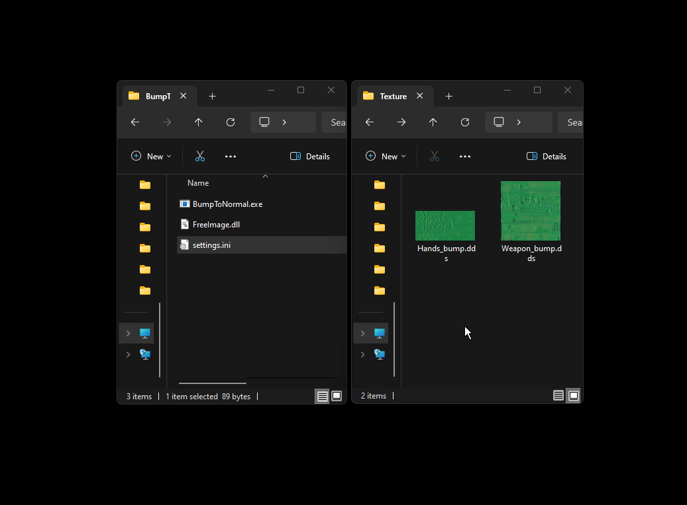

# BumpToNormal

### Settings
The program settings are made through the settings.ini file. 
If there is no file, then after opening the program, the file will be automatically created with the standard settings

* RemoveBumpFromFilename -- The setting is responsible for removing the word "bump" from the file name
* GenerateSpecFile -- The setting is responsible for enabling/disabling Specular file generation
* CloseTheProgramWithoutPause - The setting is responsible for auto-closing the program after the conversion is completed
